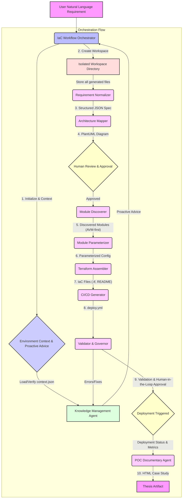

# Multi-Agent IaC Orchestration Workflow: A Thesis Framework

This document outlines the architecture and operational workflow of the multi-agent system designed for your Master's thesis Proof-of-Concept (POC). This framework orchestrates the end-to-end process of Infrastructure-as-Code (IaC) generation and CI/CD pipeline creation for Azure, emphasizing **strict workflow adherence**, **human-in-the-loop governance**, **continuous learning from mistakes**, and **reproducible documentation**.

## 1. System Architecture: The "1+9" Agentic Framework

Your system comprises a central orchestrator and nine specialized agents, each with a distinct role, collaborating to achieve the IaC deployment goal. This modular design ensures clarity, maintainability, and robust error handling.

### 1.1. The IaC Workflow Orchestrator (The Conductor)

*   **Role:** The `IaC Workflow Orchestrator` is the central intelligence, managing the entire lifecycle from initial requirement gathering to final documentation. It acts as the conductor, ensuring each agent performs its task in sequence, adheres to strict protocols, and passes validated outputs to the next stage.
*   **Key Responsibilities:**
    *   **Environment Initialization & Memory:** Loads and verifies environment context from `context.json`, proactively consulting the `Knowledge Management Agent` for past lessons.
    *   **Strict Phase Enforcement:** Mandates the execution of each phase, preventing skips and ensuring all outputs are generated.
    *   **Workspace Management:** Creates isolated workspace directories for each deployment, ensuring reproducibility.
    *   **Metrics Collection:** Tracks performance metrics (durations, interventions, corrections) for thesis evaluation.
    *   **Supervisory Monitoring:** Oversees sub-agent outputs for completeness and correctness.

### 1.2. Specialized Agents (The Orchestra)

Each of the nine specialized agents performs a critical function within the orchestration, operating under the strict guidance of the `IaC Workflow Orchestrator`.

#### 1.2.1. Requirement Normalizer

*   **Role:** Translates natural language infrastructure requests into a precise, structured JSON specification.
*   **Functionality:** Engages in a **strict clarification loop** to explicitly ask for missing details (VM size, OS, region, networking, etc.), ensuring an unambiguous input for subsequent agents.
*   **Learning & Discipline:** Understands its output is critical and subject to validation; errors reported contribute to the knowledge base. **Strictly adheres to the workflow defined by the `IaC Workflow Orchestrator`**, ensuring its output is always within the designated workspace.

#### 1.2.2. Architecture Mapper

*   **Role:** Visualizes the structured JSON specification as an Azure architecture diagram in PlantUML format.
*   **Functionality:** Generates PlantUML code for rendering, which is then presented for **mandatory human review and approval** by the Orchestrator. All outputs are placed within the dedicated workspace.
*   **Learning & Discipline:** Recognizes its role in providing a visual aid for human review; any discrepancies found contribute to system learning. **Strictly adheres to the workflow defined by the `IaC Workflow Orchestrator`**, ensuring its output is always within the designated workspace.

#### 1.2.3. Module Discoverer

*   **Role:** Identifies appropriate Terraform modules for IaC components, with a **strict prioritization of Azure Verified Modules (AVM)**.
*   **Functionality:** Searches AVM library first, then Terraform Registry, and only falls back to raw `azurerm` resources if no suitable module is found. Explicitly states the source type (AVM, Registry, Raw) for transparency. All outputs are placed within the dedicated workspace.
*   **Learning & Discipline:** Ensures adherence to AVM-first policy; errors in module selection are reported for learning. **Strictly adheres to the workflow defined by the `IaC Workflow Orchestrator`**, ensuring its output is always within the designated workspace.

#### 1.2.4. Module Parameterizer

*   **Role:** Configures discovered Terraform modules or raw resources with precise parameters from the structured specification and environment context.
*   **Functionality:** Maps values from the structured JSON and `context.json` to module input variables, handling default values and complex data types. All outputs are placed within the dedicated workspace.
*   **Learning & Discipline:** Understands that accurate parameterization is vital; errors leading to validation failures are reported for continuous improvement. **Strictly adheres to the workflow defined by the `IaC Workflow Orchestrator`**, ensuring its output is always within the designated workspace.

#### 1.2.5. Terraform Assembler

*   **Role:** Constructs the complete Terraform configuration files (`main.tf`, `variables.tf`, `outputs.tf`, `providers.tf`) and a `README.md`.
*   **Functionality:** Integrates parameterized module calls or raw resource definitions and the application deployment code (e.g., `cloud-init`) into deployable IaC, **strictly within the isolated workspace**.
*   **Learning & Discipline:** Recognizes the paramount importance of correct assembled code; validation failures are reported to the knowledge base. **Strictly adheres to the workflow defined by the `IaC Workflow Orchestrator`**, ensuring its output is always within the designated workspace.

#### 1.2.6. CI/CD Generator

*   **Role:** Creates the GitHub Actions workflow file (`deploy.yml`) for automating Terraform deployment.
*   **Functionality:** Templates a workflow with OIDC for secure Azure authentication, `terraform init`, `validate`, `plan` on PRs, and `apply` on merges to `main` (after human approval), **strictly within the isolated workspace**.
*   **Learning & Discipline:** Ensures correctly configured CI/CD; pipeline failures due to its output are reported for learning. **Strictly adheres to the workflow defined by the `IaC Workflow Orchestrator`**, ensuring its output is always within the designated workspace.

#### 1.2.7. Validator & Governor

*   **Role:** Ensures correctness, security, and facilitates human approval.
*   **Functionality:** Performs `terraform validate` and security checks. Executes `terraform plan` and presents the output for chat-based human approval. Applies **automated corrections** using advanced AI logic if errors are detected. **Strictly reports all errors and fixes to the `Knowledge Management Agent`**.
*   **Learning & Discipline:** Central to the learning loop, actively identifies and reports mistakes, and enforces governance policies. **Strictly adheres to the workflow defined by the `IaC Workflow Orchestrator`**.

#### 1.2.8. Knowledge Management Agent

*   **Role:** Facilitates continuous learning and self-improvement.
*   **Functionality:** Receives error and fix reports from the `Validator & Governor`, categorizes them, and maintains a persistent knowledge base (`error_knowledge_base.json`). Provides proactive advice to the `Orchestrator` based on past patterns. **Operates silently, without generating separate error documents.**
*   **Learning & Discipline:** The embodiment of the system's learning, it ensures mistakes are not repeated and contributes to system resilience. **Strictly adheres to the workflow defined by the `IaC Workflow Orchestrator`**.

#### 1.2.9. POC Documentary Agent

*   **Role:** Generates a comprehensive, academic-quality HTML case study for each deployment, serving as a primary thesis artifact.
*   **Functionality:** Runs as the final step, compiling the initial requirements, orchestration metrics, validation results, challenges, and knowledge base insights into a formal, thesis-ready HTML document, **saving the case study document within the dedicated workspace directory**.
*   **Learning & Discipline:** Ensures meticulous, gap-free documentation of every run, providing empirical evidence for thesis evaluation and reflecting the system's learning journey. **Strictly adheres to the workflow defined by the `IaC Workflow Orchestrator`**.

## 2. Workflow Diagram

## 3. Rationale for Specification-Driven Input

The choice of a **structured JSON specification** as the intermediate input for agents (after natural language normalization) is critical for several reasons, directly addressing the challenges of AI-assisted IaC generation:

*   **Reduced Hallucination & Determinism:** Natural language is inherently ambiguous. A structured JSON eliminates this ambiguity, ensuring that subsequent agents receive precise, deterministic instructions, significantly reducing the risk of AI hallucinations in code generation.
*   **Enabling Validation:** A structured specification allows for programmatic validation against schemas and rules, ensuring the proposed infrastructure is valid before any code is written. This is a cornerstone of the `Validator & Governor` agent.
*   **Human-in-the-Loop Clarity:** When human approval is required (e.g., for the architecture diagram or Terraform plan), the human is reviewing a clear, concise specification or a direct consequence of that specification, rather than trying to interpret vague natural language.
*   **Modularity & Interoperability:** JSON provides a universal, machine-readable format that allows seamless data exchange between different agents, fostering a modular and interoperable system.
*   **Auditability & Reproducibility:** The JSON specification serves as a clear record of the user's intent, enhancing the auditability and reproducibility of each deployment, which is vital for academic research.

## 4. Research Alignment & References

This multi-agent orchestration framework directly aligns with your Master's thesis research by demonstrating a novel approach to AI-assisted IaC deployment that emphasizes control, governance, and continuous improvement. It serves as a **Design Science Research (DSR) artifact**, providing a demonstrable solution to a real-world problem (efficient and reliable IaC generation) while generating new knowledge.

*   **AI-assisted CI/CD Generation using GitHub Actions:** The integration of the `CI/CD Generator` agent with OIDC and PR-based approvals showcases modern GitOps practices, enhancing automation and security [1].
*   **Human-in-the-loop Approval Workflows:** The mandatory review stages (e.g., after architecture mapping and Terraform plan) are central to your thesis, highlighting the critical role of human oversight in autonomous systems [2].
*   **Azure Infrastructure Deployment Validation:** The `Validator & Governor` agent, coupled with the `Knowledge Management Agent`, demonstrates a self-improving system that learns from errors, leading to more robust deployments [3].
*   **Comparative Evaluation against Non-agentic/Manual Deployment Approaches:** The `POC Documentary Agent` is specifically designed to collect metrics that will enable a rigorous comparative analysis, providing empirical evidence of the benefits of your agentic approach [4].
*   **Reusable Terraform Module Composition (AVM-first):** The strict prioritization of Azure Verified Modules (AVM) by the `Module Discoverer` and `Terraform Assembler` agents ensures the use of high-quality, pre-validated components, reducing errors and promoting best practices [5].

### References

[1] GitHub Actions Documentation. *About security hardening with OpenID Connect*. [Online]. Available: `https://docs.github.com/en/actions/deployment/security-hardening-with-openid-connect`

[2] Microsoft. *Human-in-the-Loop AI*. [Online]. Available: `https://www.microsoft.com/en-us/research/project/human-in-the-loop-ai/`

[3] Azure Verified Modules. *Azure Verified Modules (AVM) Overview*. [Online]. Available: `https://azure.github.io/Azure-Verified-Modules/`

[4] Hevner, A. R., March, S. T., Park, J., & Ram, S. (2004). Design science in information systems research. *MIS Quarterly*, 28(1), 75-105. [Online]. Available: `https://misq.org/misq/downloads/download/asset/183/`

[5] Terraform Registry. *Azure Provider*. [Online]. Available: `https://registry.terraform.io/providers/hashicorp/azurerm/latest/docs`

This document provides a robust foundation for your Master's thesis defense, clearly articulating the design, implementation, and academic contributions of your multi-agent IaC orchestration framework.
